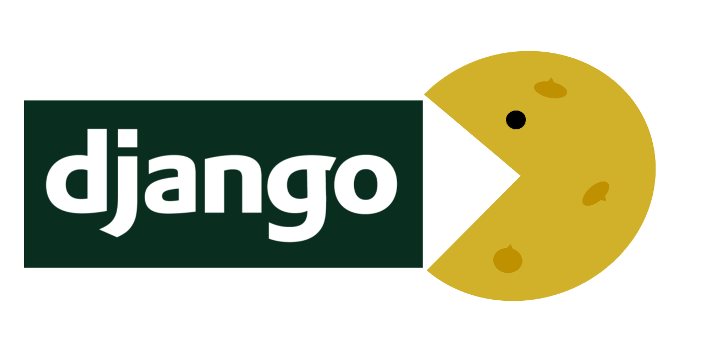

===========================
**Django APP Cookiecutter**
===========================

Only works on >= Python 3.10
----------------------------

A `Django`_  project Apps `Cookiecutter`_.

.. _Django: https://www.djangoproject.com/
.. _cookiecutter: https://github.com/cookiecutter/cookiecutter

.. image:: https://www.repostatus.org/badges/latest/active.svg
   :alt: Project Status: Active - The project has reached a stable, usable state and is being actively developed.
   :target: https://www.repostatus.org/#active

.. image:: https://img.shields.io/badge/pre--commit-enabled-brightgreen?logo=pre-commit&logoColor=white
   :target: https://github.com/pre-commit/pre-commit
   :alt: pre-commit

.. image:: https://img.shields.io/badge/%20%20%F0%9F%93%A6%F0%9F%9A%80-semantic--release-e10079.svg
   :target: https://python-semantic-release.readthedocs.io/en/latest/
   :alt: Python Sementic Release

Django App Features
-------------------

#. Easy for new users to generate a custom App.
#. Removes typing the common imports.
#. Automatically populates with correct names up to three layers deep from the project root folder.
#. Works hand in hand with `Django-Cookiecutter Project`_.

How to use it
-------------

#. Navigate to the Django project folder you want your new app.
#. In the CLI type cookiecutter git@github.com:imAsparky/django-app-cookiecutter.git
#. Enter a verbose name e.g. `My New Django App`. The Django app name will
   automatically generate like this `my_new_django_app`.
#. Select depth from the project root folder. Defaults to your new app creation in the project root folder.

.. _Django-Cookiecutter Project: https://github.com/imAsparky/django-cookiecutter
